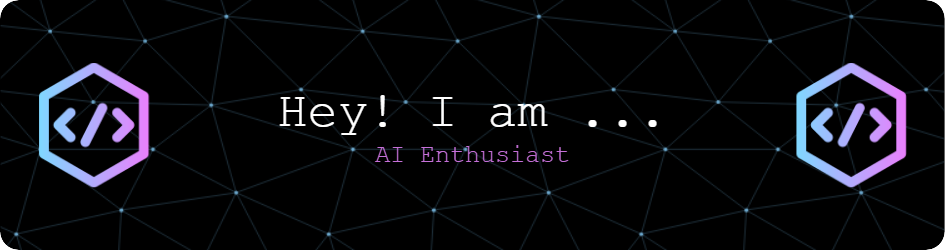

<h1 align="center">Hi 👋, I'm Soumik</h1>
<h3 align="center">Data Enthusiast Exploring the World of Generative AI</h3>

  

  

- 🌱 I’m currently learning **Langchain,Node.Js,Javascript**

- 👯 I’m looking to collaborate on **Machine learning projects**

- 💬 Ask me about **Machine Learning , Data Analysis , Generative AI**

- 📫 How to reach me **soumikmallick8112003@gmail.com**

- ⚡ Fun fact **I love exploring AI Tools**

<h3 align="left">Connect with me:</h3>

<h3 align="left">Languages and Tools:</h3>

               

&nbsp;

    
